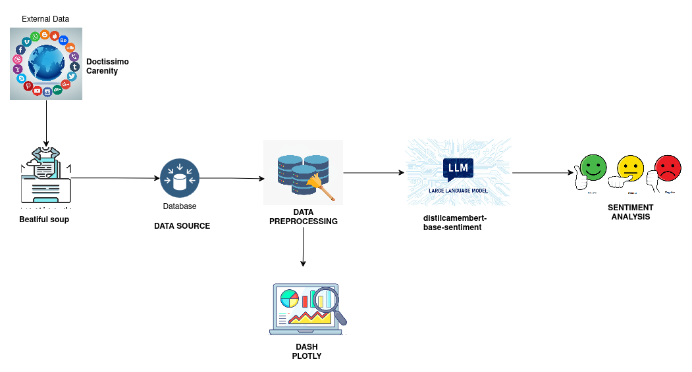

# Mieux comprendre les dysthyroïdies : Étude infodémiologique des forums en ligne

## Description du projet

Ce projet a été réalisé dans le cadre du Data Challenge de Centrale Lille en collaboration avec l'entreprise THRD (Tyropartner). L'objectif était de mener une étude infodémiologique afin de mieux comprendre les dysthyroïdies à travers les discussions sur les forums en ligne.

**Infodémiologie** : Un domaine qui combine "information" et "épidémiologie", visant à analyser les données issues des médias numériques pour détecter les tendances de santé publique.

---

## Pipeline du projet

  

### Extraction des données

- **Sources** : Doctissimo, Carenity.
- **Technique** : Web scraping avec BeautifulSoup.

### Prétraitement des données

- Suppression des caractères spéciaux.
- Suppression des balises HTML.
- Suppression des stop words.
- Lemmatisation.

Ces étapes garantissent une meilleure qualité des textes et facilitent une analyse précise des ressentis exprimés par les patients.

---

## Analyse des sentiments

- **Modèle utilisé** : DistilCamembert, une version allégée et optimisée de Camembert, spécialement conçue pour le traitement du français.

---
